# Sci Paper Plot Skill

Reusable Codex skill and Matplotlib templates for SCI paper figures, with an emphasis on compact mechanical dynamics and machine-learning result plots.

面向 SCI 论文图片的 Codex Skill 与 Matplotlib 模板，重点适配机械非线性动力学、系统辨识、不确定性分析和机器学习结果图。

## Overview / 简介

`sci-paper-plot-skill` helps Codex classify existing paper figures, audit exported images, trace Jupyter `savefig` sources, and create consistent publication-style Matplotlib plots.

`sci-paper-plot-skill` 可以帮助 Codex 对论文图片分类、检查已导出的图片、追踪 Jupyter Notebook 中的 `savefig` 来源，并生成风格一致的 SCI 论文图。

The default visual style is still named `MSSP Compact Dynamics`, and the Python helper module remains `scimplstyle_mssp` for compatibility.

默认视觉风格仍称为 `MSSP Compact Dynamics`，Python 辅助模块仍保留为 `scimplstyle_mssp`，方便兼容已有 demo 和代码。

## Reference Paper / 参考论文

This skill now includes a figure-by-figure template map for:

本 skill 已加入以下论文的逐图绘制模板：

- Yusheng Wang, Hui Qian, Qinghua Liu, Yinhang Ma, Dong Jiang. **Hierarchical Bayesian model for identifying clearance-type nonlinear system**. *Mechanical Systems and Signal Processing*, 235, 112891, 2025.
- DOI: [10.1016/j.ymssp.2025.112891](https://doi.org/10.1016/j.ymssp.2025.112891)
- ScienceDirect: [article page](https://www.sciencedirect.com/science/article/abs/pii/S0888327025005928)

The template map is in `references/hb-clearance-paper-figure-templates.md`, and the runnable placeholder demo is `scripts/demos/demo_hb_clearance_templates.py`.

逐图模板说明位于 `references/hb-clearance-paper-figure-templates.md`，可运行的占位数据模板脚本是 `scripts/demos/demo_hb_clearance_templates.py`。

## Paper Figure Preview / 论文图片展示

These are compressed README previews of the available exported manuscript figures. The source archive currently contains Fig. 4-Fig. 12 and Fig. 14-Fig. 18; exported previews for Fig. 1-Fig. 3 and Fig. 13 were not present in the local figure folder used for this update.

下面是已导出论文图的 README 压缩预览。当前本地图像目录中能找到 Fig. 4-Fig. 12 和 Fig. 14-Fig. 18；本次没有在本地图像目录中找到 Fig. 1-Fig. 3 和 Fig. 13 的导出图。

<table>
  <tr>
    <td width="50%">
      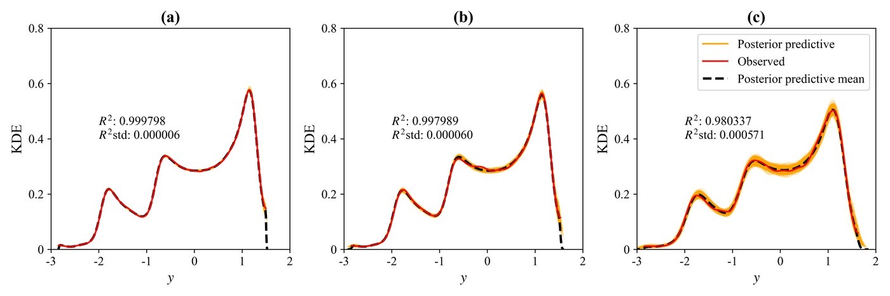
      <br>
      <sub>Fig. 4 / Posterior predictive KDE</sub>
    </td>
    <td width="50%">
      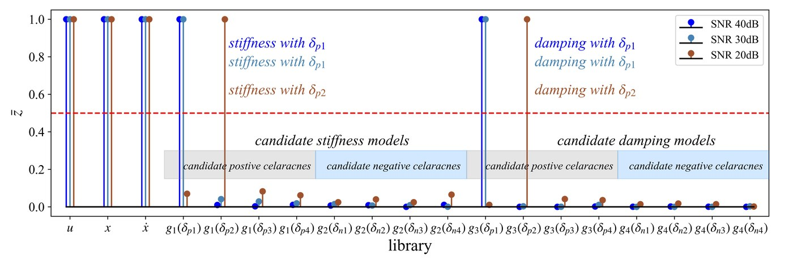
      <br>
      <sub>Fig. 5 / Candidate library selection</sub>
    </td>
  </tr>
  <tr>
    <td width="50%">
      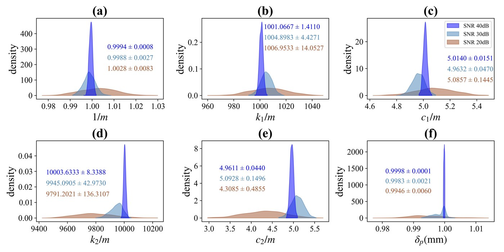
      <br>
      <sub>Fig. 6 / Posterior density grid</sub>
    </td>
    <td width="50%">
      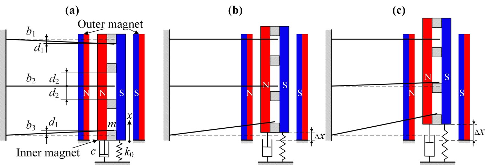
      <br>
      <sub>Fig. 7 / Tri-stable mechanism schematic</sub>
    </td>
  </tr>
  <tr>
    <td width="50%">
      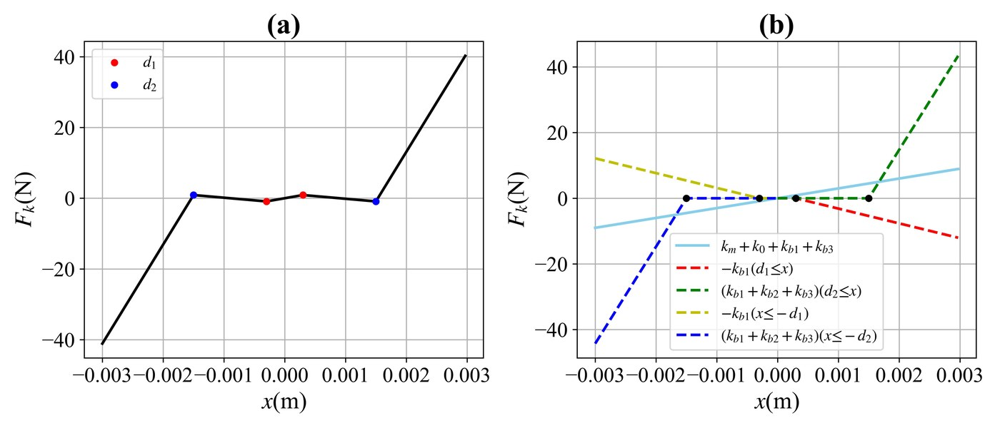
      <br>
      <sub>Fig. 8 / Piecewise restoring force</sub>
    </td>
    <td width="50%">
      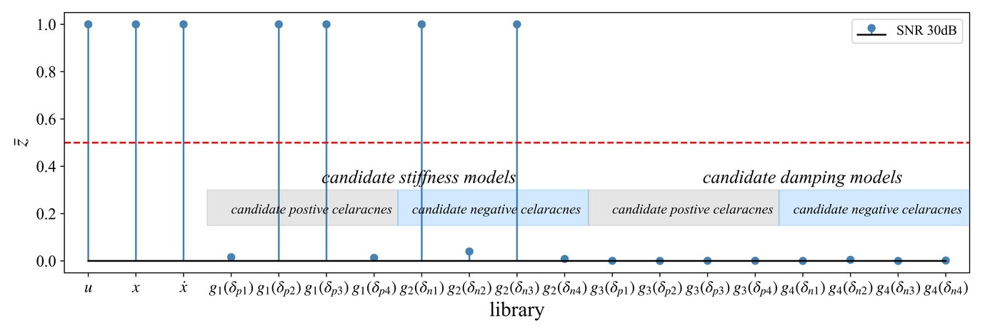
      <br>
      <sub>Fig. 9 / Candidate library selection</sub>
    </td>
  </tr>
  <tr>
    <td width="50%">
      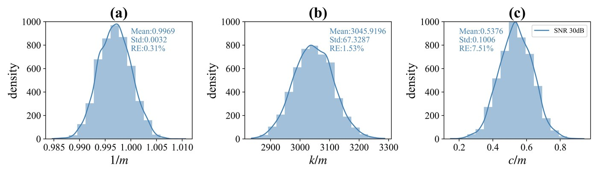
      <br>
      <sub>Fig. 10 / Posterior density triplet</sub>
    </td>
    <td width="50%">
      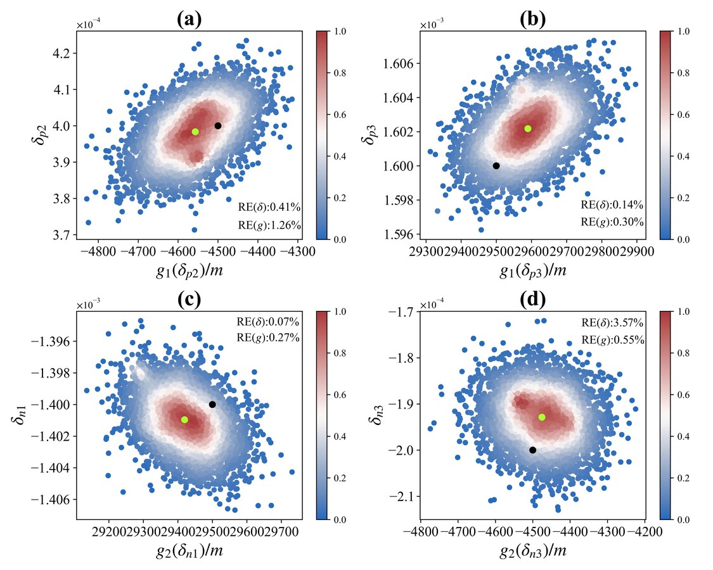
      <br>
      <sub>Fig. 11 / Joint posterior scatter</sub>
    </td>
  </tr>
  <tr>
    <td width="50%">
      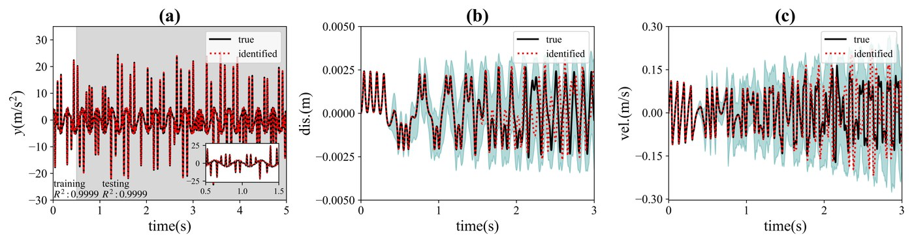
      <br>
      <sub>Fig. 12 / Validation time series</sub>
    </td>
    <td width="50%">
      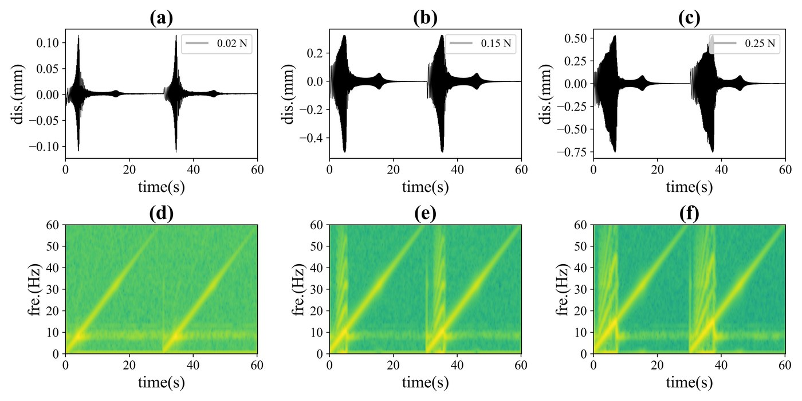
      <br>
      <sub>Fig. 14 / Time-frequency response</sub>
    </td>
  </tr>
  <tr>
    <td width="50%">
      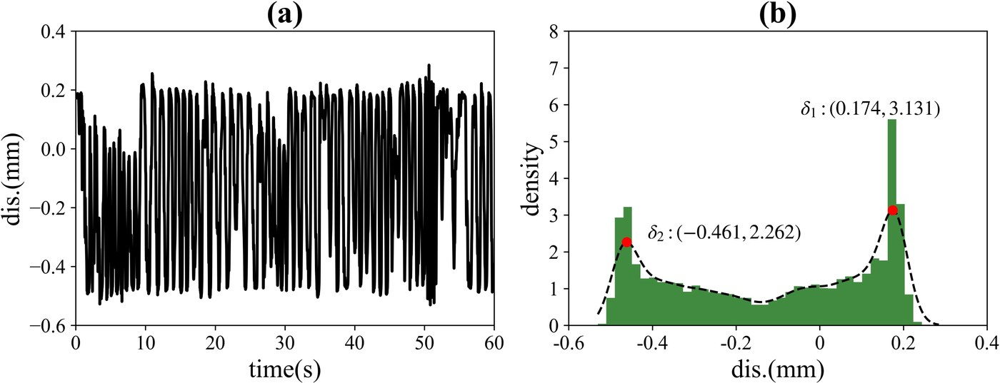
      <br>
      <sub>Fig. 15 / Time response and density</sub>
    </td>
    <td width="50%">
      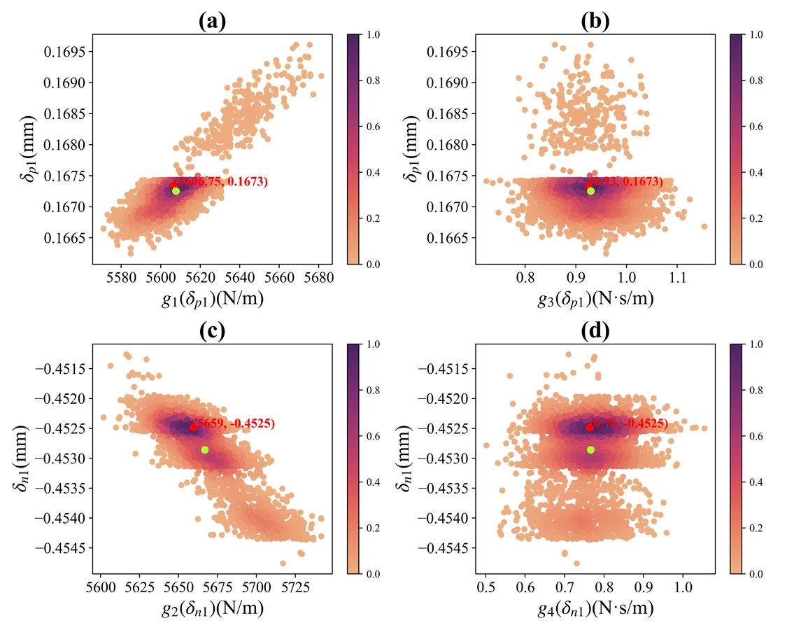
      <br>
      <sub>Fig. 16 / Experimental joint posterior</sub>
    </td>
  </tr>
  <tr>
    <td width="50%">
      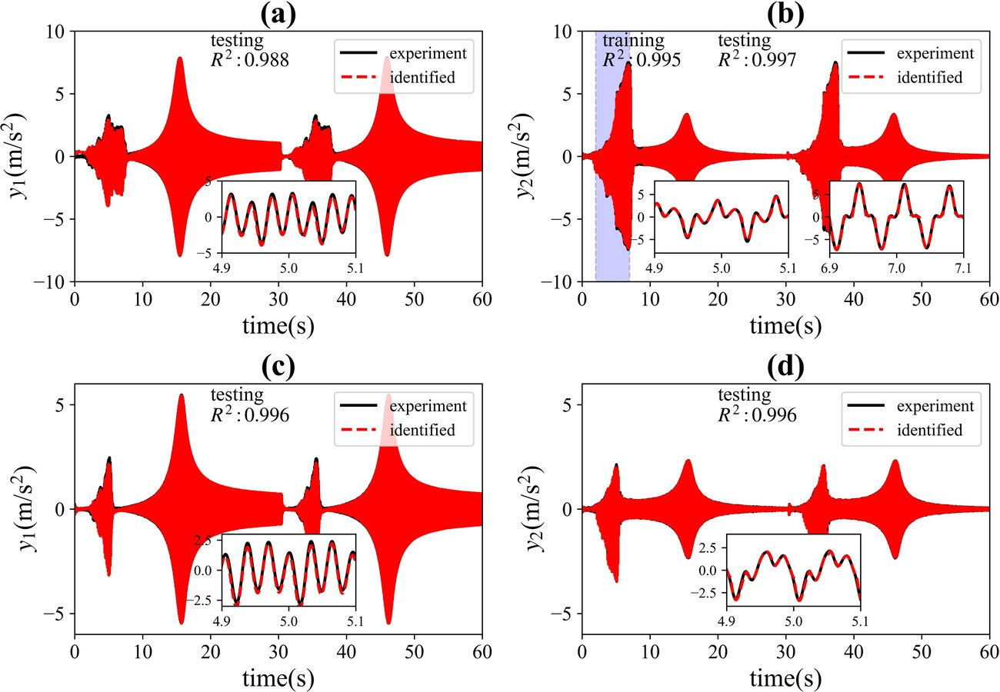
      <br>
      <sub>Fig. 17 / Multi-response validation</sub>
    </td>
    <td width="50%">
      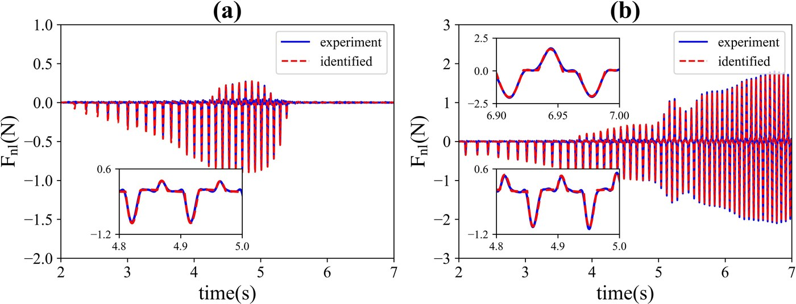
      <br>
      <sub>Fig. 18 / Force and phase validation</sub>
    </td>
  </tr>
</table>

## Example Figures / 示例图片

<table>
  <tr>
    <td width="50%">
      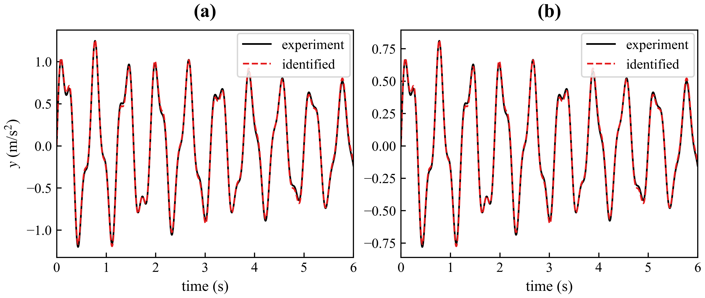
      <br>
      <sub>Validation comparison / 验证与预测对比</sub>
    </td>
    <td width="50%">
      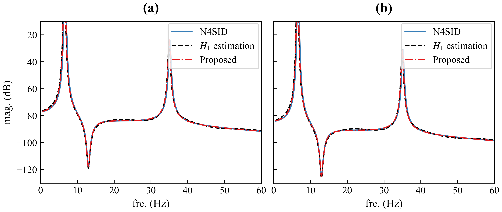
      <br>
      <sub>FRF comparison / 频响函数对比</sub>
    </td>
  </tr>
  <tr>
    <td width="50%">
      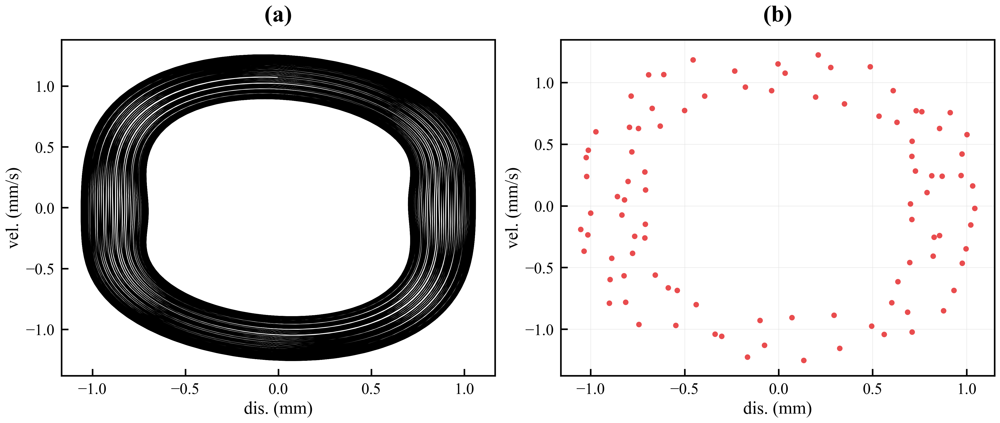
      <br>
      <sub>Phase and Poincare / 相图与 Poincare 截面</sub>
    </td>
    <td width="50%">
      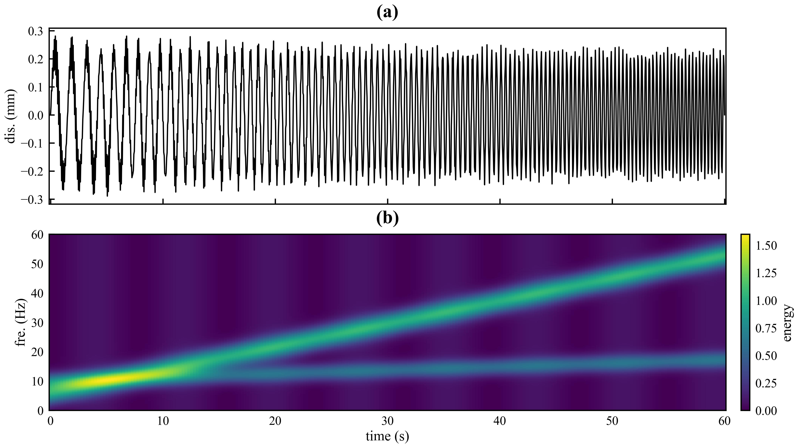
      <br>
      <sub>Time-frequency map / 时频图</sub>
    </td>
  </tr>
  <tr>
    <td width="50%">
      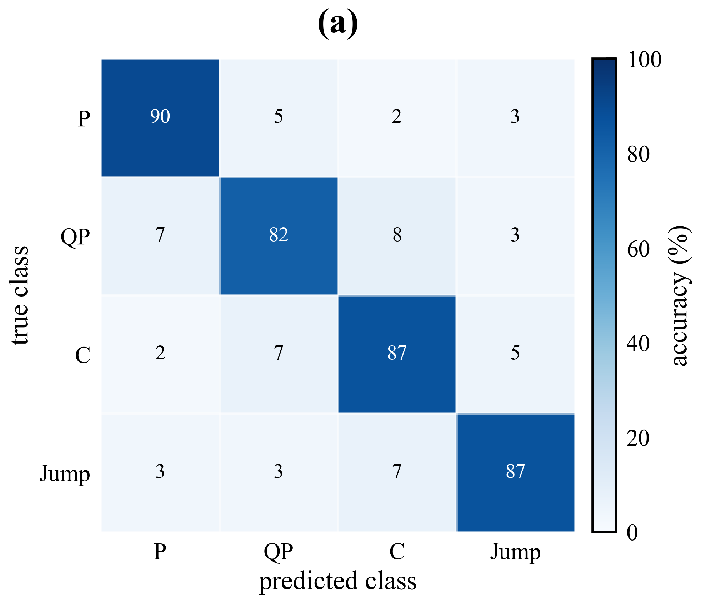
      <br>
      <sub>Confusion matrix / 混淆矩阵</sub>
    </td>
    <td width="50%">
      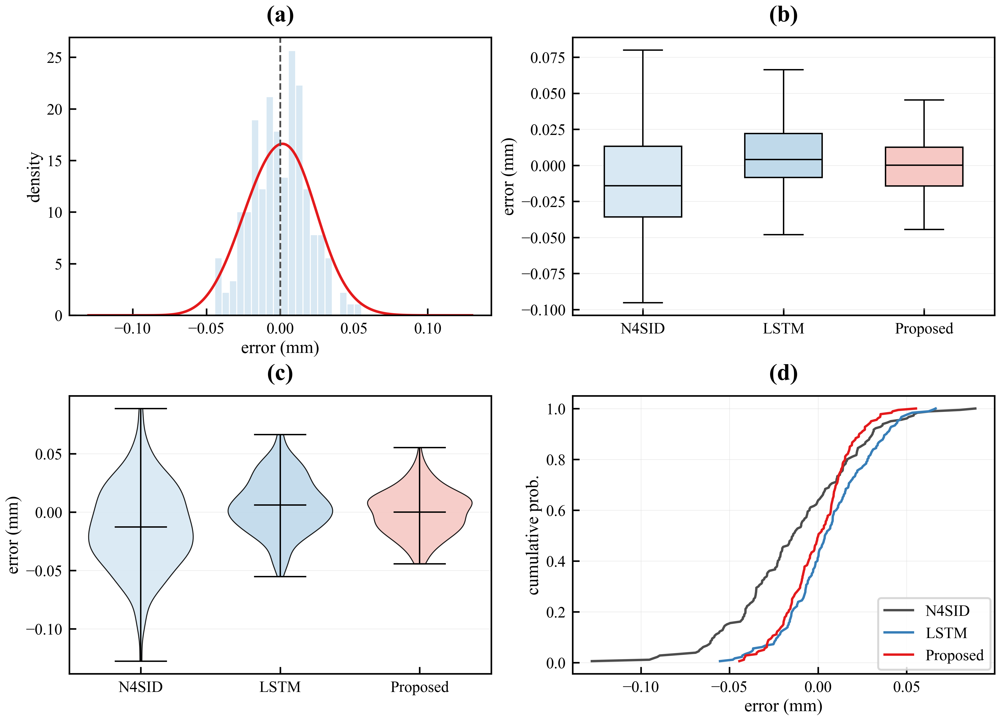
      <br>
      <sub>Distribution gallery / 分布类图</sub>
    </td>
  </tr>
</table>

## What It Covers / 覆盖内容

- Paper figure inventory and style audit / 论文图片清单与风格检查
- Model validation, FRF, time response, time-frequency, phase, Poincare, bifurcation, basin plots / 验证图、频响图、时域响应、时频图、相图、Poincare 图、分岔图、吸引域图
- Local zoom inset for validation, FRF, and peak-region detail / 用于验证图、频响图、峰值区域细节的局部放大图
- Duffing, Van der Pol, pendulum, Bouc-Wen, nonlinear restoring force, and sparse identification plots / Duffing、Van der Pol、摆、Bouc-Wen、非线性恢复力和稀疏辨识图
- ML result plots such as confusion matrix, ROC/PR, radar chart, feature importance, residual KDE, heatmap / 机器学习常用图，如混淆矩阵、ROC/PR、雷达图、特征重要性、残差 KDE、热力图
- Compact SCI layout rules: Times New Roman, 600 dpi PNG, careful legends, light grids, unclipped labels / 紧凑 SCI 排版：Times New Roman、600 dpi PNG、图例不遮挡数据、浅网格、坐标标签不截断

## Nonlinear Dynamics Demos / 非线性动力学示例

| Demo / 示例 | Manuscript use / 论文用途 |
|---|---|
| `demo_duffing_identification.py` | Duffing time validation, phase portrait, restoring force, identified coefficients / Duffing 时域验证、相图、恢复力、参数辨识 |
| `demo_nonlinear_systems_gallery.py` | Duffing, Van der Pol, pendulum, and Bouc-Wen comparison / 常见非线性系统对比 |
| `demo_nonlinear_identification_library.py` | Sparse candidate-library coefficients and prediction residual / 稀疏候选库系数与预测残差 |
| `demo_hb_clearance_templates.py` | Fig. 1-Fig. 18 templates for the hierarchical Bayesian clearance-system paper / 层次贝叶斯间隙非线性论文逐图模板 |
| `demo_validation_inset_zoom.py` | Full validation curve with local magnified inset / 带局部放大图的整体验证曲线 |
| `demo_phase_poincare.py` | Phase portrait and Poincare section / 相图与 Poincare 截面 |
| `demo_bifurcation_diagram.py` | Bifurcation-style response branches / 分岔响应分支 |
| `demo_time_frequency_map.py` | Time response and time-frequency map / 时域响应与时频图 |

## Axis Label Examples / 坐标轴标签示例

Use lowercase compact quantity names, but keep official unit capitalization. For example, use `force (N)`, not `force (n)`.

变量名建议使用小写缩写，但单位符号仍按国际标准大小写。例如应写 `force (N)`，不要写成 `force (n)`。

| Type / 类型 | Recommended labels / 推荐写法 |
|---|---|
| Time and frequency / 时间与频率 | `time (s)`, `period (s)`, `fre. (Hz)`, `ang. fre. (rad/s)` |
| Response / 响应量 | `dis. (mm)`, `vel. (mm/s)`, `acc. (m/s^2)`, `amp. (mm)`, `peak dis. (mm)` |
| FRF and spectra / 频响与谱 | `mag. (dB)`, `phase (deg)`, `psd (dB/Hz)`, `energy (-)` |
| Mechanical quantities / 力学量 | `force (N)`, `moment (N m)`, `torque (N m)`, `stiff. (N/mm)`, `damp. (N s/m)` |
| Material or field quantities / 材料或场量 | `strain (-)`, `stress (MPa)`, `pressure (kPa)`, `temp. (K)` |
| ML metrics / 机器学习指标 | `acc. (%)`, `err. (%)`, `rmse (mm)`, `mae (mm)`, `loss (-)`, `f1 score (-)`, `auc (-)` |

## Quick Start / 快速开始

Install dependencies:

安装依赖：

```bash
python -m pip install -r requirements.txt
```

List available demos:

查看 demo 列表：

```bash
python scripts/scimplstyle_mssp_cli.py list-demos
```

Copy demo scripts to a working folder:

复制 demo 脚本到你的工作目录：

```bash
mkdir paper-plot-workspace
python scripts/scimplstyle_mssp_cli.py copy-demos paper-plot-workspace
```

Run a copied demo:

运行复制后的 demo：

```bash
cd paper-plot-workspace
python demo_line_plot.py
```

The generated PNG files will be written to `paper-plot-workspace/output/`.

生成的 PNG 图片会写入 `paper-plot-workspace/output/`。

Run the hierarchical Bayesian clearance-system template set:

运行层次贝叶斯间隙非线性论文的逐图模板：

```bash
python scripts/demos/demo_hb_clearance_templates.py
```

This generates placeholder templates for Fig. 1 through Fig. 18. Replace the synthetic arrays with manuscript data when regenerating a real figure.

该脚本会生成 Fig. 1 至 Fig. 18 的占位模板。真正复现论文图时，把脚本中的合成数组替换成论文数据即可。

Audit a figure folder:

检查论文图片文件夹：

```bash
python scripts/audit_figures.py "path/to/paper/figures" --markdown
```

## Using The Style In Python / 在 Python 中使用

```python
from pathlib import Path

import matplotlib.pyplot as plt
import numpy as np

from scimplstyle_mssp import apply_sci_style, figure_size, panel_label, save_figure

apply_sci_style()

x = np.linspace(0.0, 10.0, 300)
y = np.sin(x) * np.exp(-0.08 * x)

fig, ax = plt.subplots(figsize=figure_size("single", 0.72), constrained_layout=True)
ax.plot(x, y, lw=1.4, label="response")
ax.set_xlabel("time (s)")
ax.set_ylabel("dis. (mm)")
panel_label(ax, "(a)")
ax.legend(frameon=True)

save_figure(fig, "example_line_plot", out_dir=Path("figures"))
```

For local magnified details, use `add_zoom_inset()`:

局部放大图可使用 `add_zoom_inset()`：

```python
from scimplstyle_mssp import add_zoom_inset

ax.set_ylim(ymin, ymax + extra_blank_space)
inset = add_zoom_inset(
    ax,
    xlim=(2.3, 2.8),
    ylim=(-0.35, 0.15),
    bounds=(0.07, 0.70, 0.34, 0.22),
    connectors=(1, 3),
    connector_visible=(True, False),
)
inset.plot(time, experiment, color="black")
inset.plot(time, identified, color="#E41A1C", ls="--")
```

Leave extra blank space in the parent axes for the inset, for example by widening `ylim`. If a connector crosses the data, hide that connector with `connector_visible`. Save inset figures with a slightly larger `pad_inches` such as `0.06-0.08`.

建议在主图中通过放宽 `ylim` 给局部放大图留出空白区域。若连接线穿过主曲线，可用 `connector_visible` 隐藏对应连接线，并用稍大的 `pad_inches`，例如 `0.06-0.08`，避免刻度或连接线贴边。

## Recommended Working Folder / 推荐工作目录

Use the skill folder as a reusable template library. Put user-specific plotting scripts and generated figures in your own paper/project workspace, not inside the installed skill folder.

建议把 skill 文件夹当作可复用模板库。你的论文绘图脚本和生成图片应放在自己的论文/项目工作区，不要直接写入已安装的 skill 文件夹。

```text
paper-plot-workspace/
├── demo_line_plot.py
├── demo_bar_llm_performance.py
└── output/
    ├── demo_line_plot.png
    └── demo_bar_llm_performance.png
```

For Codex usage, a good prompt is:

给 Codex 使用时，可以这样说：

```text
Use $sci-paper-plot-skill. Create the plotting script and PNG output in my current project workspace, not inside the skill folder.
```

## Repository Layout / 仓库结构

```text
sci-paper-plot-skill/
├── SKILL.md
├── README.md
├── requirements.txt
├── agents/
│   └── openai.yaml
├── assets/
│   ├── examples/
│   └── paper-figures/
├── references/
└── scripts/
    ├── audit_figures.py
    ├── package_check.py
    ├── scimplstyle_mssp.py
    ├── scimplstyle_mssp_cli.py
    └── demos/
```

## Validation / 验证

Run the package check before sharing:

分享前运行包检查：

```bash
python scripts/package_check.py .
```

The package intentionally keeps only curated preview images under `assets/examples/` and `assets/paper-figures/`. Demo-generated outputs should stay outside the skill folder and inside the user's working folder.

本仓库只保留 `assets/examples/` 和 `assets/paper-figures/` 中精选的预览图。demo 运行后生成的图片应放在 skill 文件夹外部、用户自己的工作目录中，避免把临时输出打包进去。

## Installation As A Codex Skill / 安装为 Codex Skill

Clone this repository into your Codex skills directory:

将仓库克隆到 Codex skills 目录：

```bash
git clone https://github.com/FFFxueGawaine/sci-paper-plot-skill.git ~/.codex/skills/sci-paper-plot-skill
```

Then ask Codex to use:

然后可以让 Codex 使用：

```text
Use $sci-paper-plot-skill to create a compact SCI-style FRF comparison figure.
```
